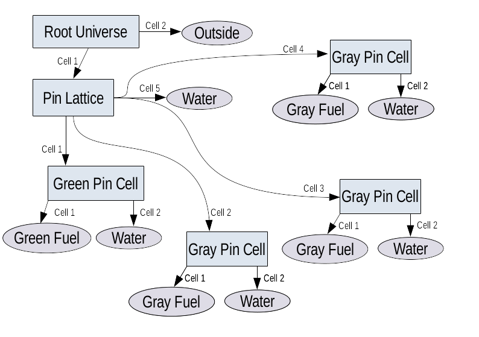
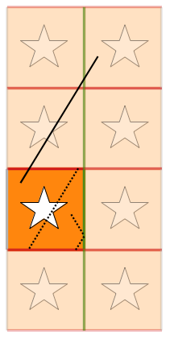
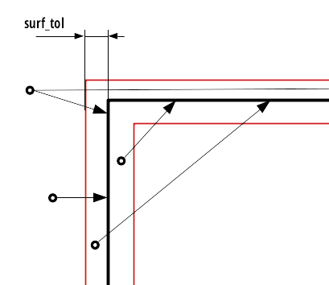
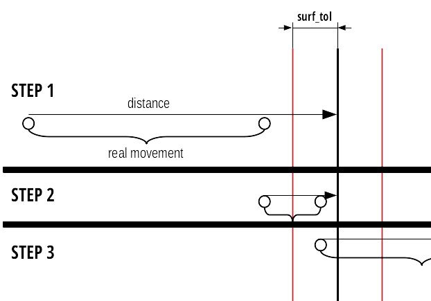

.. _Geometry:

Geometry
========

Overview
''''''''

A number of terms is going to be introduced in this section (e.g. *surface tolerance*,
*surface transparency*). These names are specific to SCONE. However, very similar concepts
can be found in other codes albeit under different names.

Constructive Solid Geometry
---------------------------

Constructive Solid Geometry (CSG) is a standard way to represent volumes in Monte Carlo codes.
Many better references that explain details of how it works are available [Salvat]_ [Briesmeister]_,
thus only a brief overview will be given here.

In principle, a surface can be represented by an equation :math:`0 = F(r)`. Thus, for any point in
a geometry it is possible to evaluate :math:`F(r) = c`. Now *halfspaces* can be defined using the
sign of the *remainder* (:math:`c`) of the surface expression. Positive (+ve) halfspace corresponds
to :math:`c > 0` and is considered an *outside* of the surface. Similarly, negative (-ve) halfspace
is associated with :math:`c < 0` and is considered an *inside* of the surface. Clearly each surface
subdivides the entire space into two halfpaces. Ideally there would be no need to consider a case
of :math:`c = 0`, as the probability of finding a randomly placed point exactly at the surface is
zero. However, in Monte Carlo transport simulations the movement of the particles is often explicitly
resolved, which means that they need to be temporally stopped at the material interface in order
to resample their flight distance. As a result, significant care must be taken to ensure
a correct behaviour of the geometry implementation in the vicinity of surfaces (small :math:`c`).

The binary subdivision of a whole space is rarely sufficient. More practical volumes can be defined
with set expressions on the halfspaces. In other words, an almost arbitrary volume can be
constructed by unions, intersections and complements (differences). A volume defined in such a way
constitutes a *cell*. It is important to note that a cell does not have to be compact [*]_ due to
the union operation, which can combine disjoint halfspaces. Computationally, it is easiest
to deal with cells that are created by intersections only. As a result, such cells are called
*simple cells*. Cells that include other logical operations (unions, complements) will be called
just *cells* or *full cells*.

.. [*] Informally, a volume is compact if it is possible to draw a continuous (curved) line between
       every two points in the volume.

.. _DAG_GEOM:

Geometry as a Directed Acyclic Graph
------------------------------------

With surfaces and cells, it is possible to subdivide the entire space into disjoint regions.
In SCONE we call such subdivision a *universe*. However, it is important to note that in principle
this subdivision may be accomplished by other means that the CSG cells introduced in the previous
section. Thus, to emphasise this difference, we call the cells that are part of a universe
*local cells*. For some universes they might be CSG cells as well, but they do not have to.

In principle, a single universe is sufficient to perform a simulation. Each local cell could be
assigned with a material and that would be complete definition of a problem domain. Such
*single level* representation might be sufficient for a number of problems. However, in
the context of a reactor physics, where the problem geometry may be composed of literally tens of
thousands individual fuel pins, the single level approach would be cumbersome to a user, error
prone and often computationally inefficient. Fortunately, it is possible to take advantage of the
repeated nature of the reactor problems via the concept of *universe nesting* (*nested universes* or
*nesting*). Instead of filling a local cell in a universe with a material, it is possible to fill
it with a *nested universe*, which is an independent, new subdivision of the entire space.
Thus, a cell with a *universe filling* becomes a portal (the cake is a lie!) into a new universe.
Consequently, it is possible that a particle is present in multiple universes simultaneously.
Each of these universes is called a level. Thus, if nesting is used, we are dealing with a
*multi-level geometry*. Furthermore, because each cell portal can be associated with a translation
and rotation, coordinates on each level may be different.

Universe nesting structure is a significantly different problem from the spatial subdivisions
within a universe. It can be represented with a directed acyclic graph (DAG).
Each universe can be considered a node in the graph with a transition (edge) associated with each
local cell in that universe. Target of a transition is the content of the cell. If the cell is a
portal, then the target is another universe node. Otherwise, if the cell is filled with a material,
transition points to a node without any transitions of its own. Effectively, it can be though of
as a universe filled entirely with a single material. Such *material node* is called a *sink*
(since it cannot be escaped, it is terminal).

Multi-level geometry must begin with a single starting universe node, which is called a
*root universe*. Now a point can be placed somewhere in this universe. This location is associated
with a specific local cell and thus a transition to another node. If the transition leads to another
nested universe the process can be repeated until the search terminates in a sink node, which
specifies the material at that original point in the geometry. In order to ensure that the search
in the graph terminates, the graph needs to be acyclic. If there were cycles (transition
paths that lead back to the same universe) there would be a danger that for some points the search
would enter an infinite loop.

.. _fig-DAGgeom:

.. figure:: Images/DAG_geom.png
  :scale: 70 %
  :align: center

  A sample directed acyclic graph representing geometry structure for a simple problem composed
  of 2x2 lattice of pins.

For illustration, :ref:`Figure 1 <fig-DAGgeom>` shows a DAG structure of a very simple geometry
composed of 2x2 lattice of pins. In SCONE, by definition, root universe is composed of two cells
only. One corresponds to the inside of the calculation domain and the other to the outside. Below
the root there is a lattice universe composed of five cells in total. Four cells are associated
with each pin cell, while the fifth cell defines the composition of the space not occupied by the
pin cell lattice. Notice that the size of the windows in root universe is such that only four
pin cells are visible. Thus, it is impossible for a particle to be present in the
5th cell in the lattice universe. However, it still needs to be defined because a universe is a
decomposition of the entire space into cells. Furthermore, the lattice contains only two different
species of fuel pins. Each is associated with a separate nested universe composed of two cells, one
defining the fuel pin and the other (stretching to infinity), which defines the surrounding
water.

.. _fig-Geomtree:

  Directed acyclic graph representing the 2x2 lattice after decomposition into a tree by coping
  instances of the grey pin universe.

The graph structure allows to speak about identity of different cells, even when they are filled
with the same material (e.g. water). By enumerating sinks of the geometry graph it is possible to
assign a *unique ID* to each region of space. This capability may be useful for e.g. burn up
calculations, in which regions filled originally with the same material can experience different
evolution of composition over irradiation time. However, the major problem of the DAG representation
of geometry as presented in :ref:`Figure 1 <fig-DAGgeom>` becomes apparent. It is that the geometry
does not distinguish individual grey pin cells. From its point of view it is just a single fuel
pin that is present in three different places simultaneously. Clearly the solution would be
to copy the grey pin universe to create separate sinks for each instances as shown in
:ref:`Figure 2 <fig-Geomtree>`, which converts the DAG into a tree. This copy could be done
"by hand" in an input file, however this is likely to be both error prone and cumbersome to a user.

However, as mentioned earlier, spatial subdivision in a universe and representation of the nesting
structure are different problems. It is significant, because the decomposition
into a tree needs to be performed only from the point of view of the structure. All of the copied
universes share the same description of the spatial subdivision despite bearing different content.
In general, description of space requires much more memory then the description of the content.
Thus, a considerable amount of memory can be saved if the copied instances of the universe share the
description of the spatial subdivision, because in many practical calculations the copied universes
may number in thousands.

The problem of assigning unique IDs to material cells can also be looked at from a slightly different
perspective by noting that each cell instance corresponds to a unique path in the DAG between source
(root universe) and the sink. Thus, the problem of a sink identity can be approached by counting
(and enumerating) unique paths in the DAG between root (source) and a particular sink.

Membership at a surface
-----------------------

As it was indicated in previous sections, some care is required when assigning membership of a point
to either halfspace of a surface in its vicinity. The main difficulty is caused by the numerical
precision of floating point numbers. When particles are moved forward by a calculated distance
to a surface, it is desirable that they cross the surface so a new material can be found. However,
in most cases the evaluated remainder :math:`c = F(r)` of the surface expression
will be different from zero after the movement. If an overshoot happened and the :math:`c` has
changed a sign it is not a problem as the particle has successfully crossed the surface. However,
in a case of undershoot the sign of :math:`c` will remain the same. This problem can be reduced in
frequency by introducing a *surface tolerance*.

When the *surface tolerance* is used, the direction of a particle is used to determine its halfspace
if the remainder :math:`c` of the surface expression is such that :math:`|c| < surf\_tol`, where
:math:`surf\_tol` is some small distance representing the surface tolerance. Thus, for example,
if :math:`c` is within the surface tolerance and a direction of particle is moving it outside the
surface, then the particle is placed in the +ve (outside) halfspace. See
:ref:`Figure 3 <fig-HSmembership>` for further details.

.. _fig-HSmembership:

.. figure:: Images/HS_membership.png
  :scale: 120 %
  :align: center

  Membership in +ve or -ve halfspace for particles close to the surface.

Boundary Conditions
-------------------

There are two main approaches to the treatment of boundary conditions, which are called *explicit*
and *co-ordinate transform*. Explicit treatment is more natural and general. In it, an explicit
tracking of the system boundary is performed. If a particle is to leak out of the system it is
moved to the boundary and the type of boundary condition is checked. If it is vacuum BC, then a
particle is removed from the calculation. If it isn't, any transformation of a particle state
can be performed (reflection, albedo reflection or transition in a periodic BCs) after which the
distance to a collision is resampled and tracking may proceed as normal.

Co-ordinate transform treatment is more subtle and it is based on the observation that in
the majority of problems, reflective and periodic BCs are introduced to convert a finite region
into an infinite lattice. If it is the case, it is possible to remove the need for explicit tracking
of the system boundary. Instead, a particle is allowed to leave a calculation domain before it is
brought back by applying an appropriate number of transformations (reflections by a surface or
translations) associated with different faces of the domain boundary. Faces associated with vacuum
BCs perform no transformations.  Then, if a particle were to escape through one of the vacuum faces,
after all transformations are applied, it will be outside the domain and may be considered to have
leaked.

:ref:`Figure 4 <fig-coordsBCs>` illustrates the principle behind co-ordinate transform BCs.
Solid colour region is the calculation domain and the semi-transparent is the infinite lattice
corresponding to the given boundary conditions. When a particle is moved, it follows the solid line
and leaves the calculation domain. Then it is possible to calculate how many transformations
are required to bring the particle back to the calculation domain (2 in y-axis, 1 in x-axis). After
the transformations are applied, the particle returns to the domain as if it has travelled along
the dashed line.

.. _fig-coordsBCs:

  Co-ordinate transform boundary conditions. Periodic BCs in vertical direction, reflective BC on
  right face and vacuum on left face in a-axis. Solid line is a true movement of a particle in
  geometry, dashed line represents the apparent movement in the domain. Transformations move the
  particle from the end of the solid line to the end of the dashed line.

Unfortunately co-ordinate transform BCs require that the particle is not stopped when crossing into
a new material, thus they can be used only together with Woodcock delta-tracking. Furthermore, the
use of the co-ordinate transformations significantly limits the available shapes of the domain
boundary and combinations of BCs at different faces. These constraints originate from the
requirement that the domain must be translatable into an infinite lattice. For example, a hexagonal
boundary with a mix of reflective and periodic boundary distinctions is not allowed.

Distance calculation & Surface Crossing
---------------------------------------

In order to track particles in the geometry it is necessary to have an ability to calculate
the distance to a point along the direction of flight where material composition or unique cell ID
changes. This can happen only at the boundaries of local cells in a universe. The main complication
in calculating the distance is related to the multi-level structure of the geometry. Since the
particle exists in multiple universes at different levels simultaneously, it is necessary to
calculate the distance to the next local cell in each of them and take the minimum. The result of
this process is both the distance as well as the level at which particle will cross to the next
cell.

It is possible that the distance to the next cell will be the same at two different levels.
If it happens, it is necessary to take the value on the higher (closer to root) level.
When performing this selection it is crucial to account for floating point precision. Floating
point numbers :math:`a` and :math:`b` are considered equal if :math:`\frac{|a-b|}{b} < \epsilon`,
where :math:`\epsilon` is some small constant (e.g. :math:`1.0e^{-10}`).

Finite precision of the floating point representation causes yet another problem. In a case of an
undershoot (where a particle should reach a surface, but is placed slightly before it) a particle
may get stuck. For a particle very close to a surface the distance may be so small that if
a particle is moved by it, its coordinates will not change (adding FP number to a much larger
FP number). Because, this small distance is likely to be chosen as the next transition, particle
will not be moved and the same problem will reoccur in the next distance calculation causing
and infinite loop.

To avoid the infinite loop it is necessary to introduce the *surface transparency*. Its principle is
illustrated in :ref:`Figure 5 <fig-DistCalc>` for the bottom particle. If a particle is
within :math:`surface\_tol` of the surface, the closest crossing (as absolute value of distance
along the flight direction) must be ignored for a purpose of distance calculation. It is crucial
to remember that the :math:`surface\_tol` is defined as a normal distance to the surface.
Thus ignoring a crossing distance :math:`d` if :math:`d < surface\_tol` is insufficient.

.. _fig-DistCalc:

  Distance that should be returned for particles in different positions close to the surface.
  Distance returned for different directions is indicated by the length of arrows.

It is possible that a particle will not reach the surface tolerance region after an undershoot.
However, if that happens the tracking has a self-correcting property as shown in
:ref:`Figure 6 <fig-UnderShotSC>`. After an initial undershoot in the 1st step, particle will
usually be moved to within a surface tolerance in the 2nd step and successfully cross the surface.
However, it is necessary to note that, although a particle should have crossed the surface in the
1st step, it did not until the 2nd step. When writing procedures that deal with cell to cell
transitions it is therefore crucial to account for such situations and remember that a particle
might have not escaped its current cell after a movement to the surface.

.. _fig-UnderShotSC:

  Self-correcting tendency for undershoots that lie outside surface tolerance.

Universe Polymorphism
---------------------

Geometry of a nuclear reactor is structured. It is a collection of a large number of repetitions
of simple arrangements such as fuel pins and fuel assemblies. Furthermore, these components are
placed in a highly regular lattices. When reactor geometry is modelled in a MC code it is possible
to use all this extra information about the structure to significantly accelerate geometry
procedures. For example, in a Cartesian lattice with constant pitch it is possible to find a cell
occupied by a particle with just few division and floor operations. Also the time required for
the search is independent of the lattice size. Similar improvements can also be obtained for
different arrangements like pin cells, fuel bundles or a pebble bed.

What is meant by *universe polymorphism* is that instead of creating few, very general
representations of universes, a large number of highly specific universes is used instead.
Each of them aims to address a particular geometrical arrangement encountered in reactor physics
problems.

Components
''''''''''

This is a list of main components used in SCONE geometry implementation with their role
(responsibility) and some extra comments.

Coord & Coord List
------------------
The purpose of the ``coords`` class in SCONE is to hold all the information related to a position
of a particle in phase-space at a single level in the geometry. The ``coordList``, as the name
suggests, is a list of ``coords``. It has a single entry for each level of the geometry. In addition
it contains extra information about material composition and unique ID at the current position.

**coords Responsibilities**:

  * Hold position (:math:`\bf{r}`) and direction (:math:`\bf{u}`) of the particle
  * Contain informations about rotations of co-ordinate frame with respect to previous level
  * Hold information about: local cell ID (``localID``); universe index (``uniIdx``); position
    of the universe in graph representation of geometry structure (``uniRootID``)

**coordList Responsibilities**:

  * Contain current the number of levels occupied by the particle (``nesting``)
  * Hold ``coords`` for each level in the geometry
  * Hold material index (``matIdx``) and unique cell ID (``uniqueID``) for the current position of
    the particle
  * Hold a position of the particle in time

It is worth to note that the ``coordList`` can exist in three different states:

  #. **Uninitialised**: All components of the ``coordList`` are unreliable and can take any values
     (e.g  direction may not be normalised to one)
  #. **Above Geometry**: Only position and direction at level 1 are reliable. ``matIdx`` and
     ``uniqueID`` are set to -ve values.
  #. **Inside Geometry**: ``coords`` at all occupied levels (indicated by ``nesting``) contain
     data that represents phase-space position at that level. ``matIdx`` and ``uniqueID`` are
     set to correct values.

Geometry Registry
-----------------

Geometry registry is an object-like module (singleton) that manages the lifetime of different
geometry and field definitions.

**Responsibilities**:

  #. Build all defined geometries and fields from dictionaries
  #. Return a pointer to a geometry or a field specified by an index (``geomIdx`` or ``fieldIdx``)

Geometry
--------

Geometry is the primary interface for interaction with a geometry representation.

**Responsibilities**:

  #. Perform movement of a particle via ``coordList``
  #. Return pixel/voxel plots of the geometry
  #. Return material/uniqueID at a given point in the geometry
  #. Initialise (put) ``coordList`` in the geometry
  #. Return axis-aligned bounding box (AABB) of the whole domain. If the box would
     stretch to infinity in some axis, width for that axis is assumed to be 0.
  #. Return a pointer to a universe indicated by ``uniIdx``

There are three types of movement in the geometry:

  #. **move**: Standard movement of a particle. It moves up to a given distance or stops after
     crossing a boundary between regions with different materials or uniqueID. If the particle
     hits the domain boundary, boundary conditions are applied and the movement is stopped. It
     is also possible that a particle may become lost, as a result of errors in geometry handling.
  #. **move global**: Movement with explicit tracking of the domain boundary. Particle moves up to
     a given distance "above" the geometry ignoring all changes in composition or unique ID.
     However, it will stop upon hitting the domain boundary (after BCs are applied).
  #. **teleport**: Particle moves by a given distance without stooping. If it hits the domain
     boundary, boundary conditions are applied and the movement is continued

Surface
-------

Surface exists to perform binary subdivision of the space into +ve and -ve halfspace. These
halfspaces are used to define smaller volumes in the problem domain.

SCONE, unlike many other Monte Carlo codes, does not limit the allowable surfaces to quadratic
surfaces. More complicated shapes like boxes, truncated cylinders or parallelepiped are permitted.
Each surface has an ID, which is a +ve integer and is used in geometry definitions in input file.
Inside SCONE, a surface is identified by its index (``surfIdx``) different from its ID.

**Responsibilities**:

  #. Determine a halfspace the particle is in (using *surface tolerance*)
  #. Calculate a distance along the flight to the next crossing between -ve and +ve halfspaces
     taking *surface transparency* into account
  #. Apply ordinary boundary conditions
  #. Apply co-ordinate transform boundary conditions
  #. Return axis-aligned bounding box (AABB), that fully encompasses a surface. If the box would
     stretch to infinity in some axis, width for that axis is assumed to be 0.

**Note that**:

  * There is no check if the surface definitions are unique. Two surfaces that are exactly the same
    but have different ID can be defined (however there is no reason to do that and it should be
    avoided).
  * It is possible that the magnitude of the *surface tolerance* may become a property of the
    surface in the future.

Cell
----

Cell exist as a separate objects only for convenience. They are intended to be used only by
universes.

Cell represents a volume of space. It may or may not use any surfaces for its definition.

**Responsibilities**:

  #. Calculate distance to the boundary of the cell given that a particle is inside the cell.
  #. Determine if a particle is in the cell
  #. Return AABB of the cell.

Universe
--------

Universe represents a complete subdivision of the space into a disjoint regions (called *local
cells*), each assigned with a local ID. Furthermore, it is a part of the geometry interface and
user code may (if required) interact with universes directly (pointer to a universe can be obtained
form geometry).

Each universe may be associated with an offset and/or rotation, which is applied to the coordinates
upon entering the universe from a higher level.

Each local cell in a universe can also have an offset, which is a translation applied to
co-ordinates before entering a lower level universe through the local cell. Thus, the position
of a particle when it enters from a higher universe (0) to a lower universe (1) changes as follows:

.. math::

  \mathbf{r}_1 = \mathbf{r}_0 - \mathbf{R}_{uni} - \mathbf{R}_{cell}

Where :math:`\bf{R}_{uni}` is the offset of universe 1 and :math:`\bf{R}_{cell}` is
the local cell offset from universe 0. Similarly, the direction and position of a particle can
undergo a rotation, which is defined in terms of Euler angles (:math:`\phi, \theta, \psi`) that
follow so called `x-convention <https://mathworld.wolfram.com/EulerAngles.html>`_:

.. math::

     \mathbf{A}= \left[  \begin{array}{ccc}
      \cos\psi \cos\phi - \cos\theta \sin\phi \sin\psi &
      \cos\psi \sin\phi + \cos\theta \cos\phi \sin\psi &
      \sin\psi \sin\theta \\
     -\sin\psi \cos\phi - \cos\theta \sin\phi \cos\psi &
     -\sin\psi \sin\phi + \cos\theta \cos\phi \cos\psi &
      \cos\psi \sin\theta \\
      \sin\theta \sin\phi &
     -\sin\theta \cos\phi &
      \cos\theta \\ \end{array} \right]

.. math::
   \mathbf{u}_1 = \mathbf{A} \mathbf{u}_0

.. math::
  \mathbf{r}_{1r} = \mathbf{A} \mathbf{r}_1

Note that the translation due to offset is performed before rotation. The *x-convention* for Euler
angles is also called ZXZ because the 1st rotation (by :math:`\phi \in \left<0,2 \pi \right>`) is
performed over the Z-axis. The 2nd rotation (by :math:`\theta \in \left<0,\pi \right>`) is around
the rotated X-axis and the last rotation (by :math:`\psi \in \left<0,2 \pi \right>` ) is by the
rotated Z-axis.

**Responsibilities**:

  #. Enter the universe from a higher geometry level. Find local cell and apply any co-ordinate
     transformations.
  #. Find local cell in the universe given particle position & direction.
  #. Calculate distance to the next boundary between local cells along a direction of a particle.
  #. Given that a particle is at the boundary of a local cell, find ID of the next local cell.
  #. Return an offset for a local cell.

**Notes**:

  * Procedures for: distance, finding local cell, performing crossing are passed with universe
    with an intent `inout`, which means that they can modify a universe state. However, it can
    cause problems in parallel calculations. Thus, under normal circumstances **these procedures
    should not change the state of a universe**. If they do, it is responsibility of the programmer
    to ensure that these modifications would work in parallel calculations.
  * The procedure that calculates distance also returns a surface index, which is determined by
    the universe. It is used to identify a surface, which is the next boundary along the particle
    direction. Positive values of ``surfIdx`` indicate a surface that has been defined on
    ``surfaceShelf``. Negative values indicate internal surfaces, that are defined only in the
    universe. The value of the ``surfIdx`` provided in distance calculation is returned as an
    input argument to the procedure that performs local cell crossings to potentially
    accelerate/simplify it.

Hole Universe
-------------

Hole universe is a special type of a universe that does not support distance calculations and
local cell-to-cell crossings. It is named as a tribute to MONK Monte Carlo code. Like in MONK, hole
universe represents a geometrical set-up which is unfeasible to model with surface tracking.
However, it is still a subclass of ``universe`` so it must implement the distance & crossing
procedures. Thus, if either of these procedures are called on a hole universe, execution is
terminated with a fatal error.

Fields
------

Fields are special geometry objects that are meant to represents scalar and vector fields imposed
over geometry. They take ``coordList`` as an input to have access to parameters such as ``matIdx``
or ``uniqueID``, which might be useful when defining spatial variation of the field. For example,
for an electric field, each material index may be associated with a different permittivity.

It is important to note that a field does not have to have physical interpretation. For example
a field should be used to represent target weight distribution for weight windows variance
reduction.

**Responsibilities**:

  #. Given ``coordList`` return single vector or scalar associated with the point.

Note that for now both the vector and scalar are real. Fields might be extended to complex
numbers in the future.

Geometry Graph
--------------

As indicated in :ref:`previous section <DAG_GEOM>`, the structure of the universe nesting may be
represented by a directed acyclic graph. In SCONE this representation is decoupled from the
description of the spatial subdivision (via universes). ``geomGraph`` is meant to hold the graph
of the universe nesting.

**Responsibilities**:

  #. Accept information about composition from universes during initialisation phase.
  #. Check the validity of geometry structure
  #. Change graph representation to support generation of unique cells
  #. Given a position of a universe in the graph (``uniRootID``) and local
     cell identifier (``localID``) return:

        * ``matIdx`` and ``uniqueID`` if the local cell contains material
        * ``uniIdx`` and new ``uniRootID`` if local cell contains a nested universe.

Geometry structure is considered valid if:

  #. Special *outside* material is not present below the root universe
  #. There is no recurrence in the universe structure (is acyclic)
  #. Depth of the universe structure does not exceed the hardcoded limit (``MAX_GEOM_NEST``)

Note:

  * The convention is that all ``matIdx`` are +ve. Thus, it is possible to use the sign bit to
    distinguish between material and universe fill stored in the same integer array.

References
''''''''''

.. [Salvat] F. Salvat, "PENELOPE-2014: A Code System for Monte Carlo Simulation of Electron and Photon Transport",
       NEA, NEA/NSC/DOC(2015)3, 2015.
.. [Briesmeister] J. F. Briesmeister, "MCNP - A General Monte Carlo N-Particle Transport Code", LANL, LA-13709-M, 2000.
